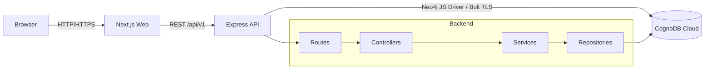
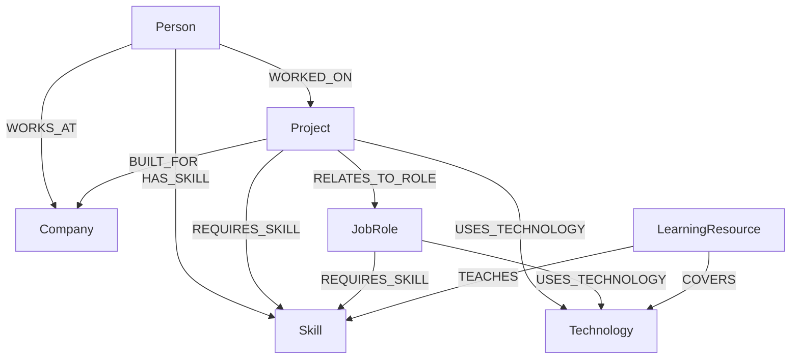

# SkillGraph

SkillGraph is a graph-powered technology skills and career relationship explorer built for the Wexa AI CognoDB assignment. It helps users understand how people, skills, technologies, projects, job roles, companies, and learning resources connect—and turns those connections into practical career recommendations.

## Problem

Career data is highly connected. People apply skills on projects, projects use technologies, roles require capabilities, and learning resources teach the skills someone is missing. A relational design can store this information, but multi-hop questions require long join chains and application-side aggregation.

## Why a graph database?

CognoDB stores relationships as first-class data and lets SkillGraph traverse the domain directly with openCypher:

```text
Person → HAS_SKILL → Skill ← REQUIRES_SKILL ← JobRole
                                      ↑
                          TEACHES ← LearningResource
```

This supports readable multi-hop traversal, career-gap analysis, explainable recommendations, and interactive neighborhood exploration. In a relational implementation, the same career query would join people, person skills, role requirements, skills, resource mappings, technologies, and project associations.

## Features

- Live graph statistics dashboard
- Searchable, paginated people, skills, and roles explorers
- Person profiles with company, skills, projects, and technologies
- Skill and role relationship detail pages
- Career readiness percentage, matched skills, missing skills, technologies, and resources
- Interactive graph with person selection, node inspection, expansion, zoom, pan, and reset
- Responsive navigation and layouts
- Loading skeletons, empty states, safe errors, and custom 404 handling
- Parameterized openCypher through the official Neo4j JavaScript driver
- Production Docker images, Compose health checks, and non-root containers
- Deterministic API tests and opt-in live CognoDB integration tests

## Architecture



The browser never connects directly to CognoDB. See [Architecture](docs/architecture.md).

## Graph data model



Every node has a stable public string `id`. See [Graph Data Model](docs/data-model.md).

## Technology stack

| Layer          | Technology                                                         |
| -------------- | ------------------------------------------------------------------ |
| Frontend       | Next.js, React, TypeScript, Tailwind CSS, Lucide React, React Flow |
| Backend        | Node.js, Express, TypeScript, Zod                                  |
| Database       | CognoDB, openCypher, Bolt TLS                                      |
| Driver         | Official Neo4j JavaScript driver                                   |
| Testing        | Vitest, Supertest                                                  |
| Infrastructure | Docker, Docker Compose                                             |

## Repository structure

```text
skillgraph-cognodb/
├── apps/
│   ├── api/               # Express and CognoDB integration
│   └── web/               # Next.js product interface
├── packages/types/
├── database/
│   ├── queries/
│   └── schema/
├── docs/
├── docker-compose.yml
└── .env.example
```

## Prerequisites

- Node.js 20+
- npm 10+
- CognoDB Cloud instance and encrypted Bolt URI
- Docker Desktop for the container workflow

## Installation

```bash
git clone https://github.com/poundsmichaelscode/skillgraph-cognodb.git
cd skillgraph-cognodb
npm install
cp .env.example .env
```

Configure the ignored `.env` file with your own CognoDB values. Never commit it or expose database variables with a `NEXT_PUBLIC_` prefix.

## Database setup

Create a CognoDB instance, obtain its Bolt URI and credentials, then run:

```bash
npm run db:schema --workspace=@skillgraph/api
npm run db:seed --workspace=@skillgraph/api
```

The idempotent seed uses stable IDs and `MERGE`. It defines 125 nodes and 517 relationships:

| Entity             | Count |
| ------------------ | ----: |
| Companies          |    10 |
| Skills             |    25 |
| Technologies       |    18 |
| Job roles          |    12 |
| Projects           |    18 |
| People             |    24 |
| Learning resources |    18 |

All people and organizations are fictional.

## Local development

Terminal 1:

```bash
npm run dev:api
```

Terminal 2:

```bash
npm run dev:web
```

- Web: `http://localhost:3000`
- Health: `http://localhost:4000/api/v1/health`

## Docker

With `.env` configured:

```bash
docker compose up --build
```

The API health check includes CognoDB connectivity and the web service waits for it. Stop with:

```bash
docker compose down
```

Secrets are injected into the API only at runtime and are never copied into images.

## API

All endpoints use `/api/v1`.

| Endpoint                                                                                     | Purpose                        |
| -------------------------------------------------------------------------------------------- | ------------------------------ |
| `GET /health`                                                                                | API and database readiness     |
| `GET /stats`                                                                                 | Graph totals                   |
| `GET /people`, `/skills`, `/technologies`, `/projects`, `/roles`, `/companies`, `/resources` | Paginated catalogs             |
| `GET /people/:id`, `/skills/:id`, `/roles/:id`                                               | Relationship-rich details      |
| `GET /search?q=`                                                                             | Cross-label search             |
| `GET /graph/:type/:id`                                                                       | Graph neighborhood             |
| `GET /career-path/:personId/:roleId`                                                         | Career gap and recommendations |
| `GET /discover/technology/:id/people`                                                        | Multi-hop technology discovery |

See [API Reference](docs/api.md).

## Important graph query

```cypher
MATCH (person:Person {id: $personId})
MATCH (role:JobRole {id: $roleId})-[requirement:REQUIRES_SKILL]->(skill:Skill)
OPTIONAL MATCH (person)-[ability:HAS_SKILL]->(skill)
OPTIONAL MATCH (resource:LearningResource)-[:TEACHES]->(skill)
RETURN person, role, skill, requirement, ability,
       collect(DISTINCT resource) AS learningResources
ORDER BY skill.name
```

All user-controlled values are parameters. Dynamic labels are selected only from typed server-side allowlists. See [Important Queries](docs/queries.md).

## Testing

```bash
npm run typecheck
npm run lint
npm test
npm run build
```

Run real seeded CognoDB integration tests explicitly:

```bash
RUN_COGNODB_INTEGRATION=true npm test --workspace=@skillgraph/api
```

See [Testing](docs/testing.md).

## Security

- Backend-only CognoDB environment variables
- Ignored `.env`, generated output, and Docker build artifacts
- Parameterized Cypher values and typed label allowlists
- Zod request validation
- Helmet, restricted CORS, and API rate limiting
- Sanitized errors without credentials, stack traces, or raw queries
- Non-root production containers
- Frontend frame, MIME, referrer, permissions, opener, and transport headers

## Deployment

Intended production topology:

```text
Managed Next.js hosting → HTTPS REST API → CognoDB Cloud over Bolt TLS
```

Set `NEXT_PUBLIC_API_URL` to the public API base URL at web build time, set `WEB_ORIGIN` to the deployed frontend origin, and configure CognoDB variables only on the API service. Deployment URLs and screenshots are added after production verification.

## Engineering decisions

- A monorepo keeps the web, API, database assets, and tooling together.
- Routes and controllers handle HTTP, services own domain behavior, and repositories own Cypher.
- Server Components load directories and details; Client Components handle career and graph interaction.
- Stable public IDs avoid exposing database-internal identities.
- The seed is repeatable and safe to rerun.
- Ordinary tests are deterministic; live CognoDB tests are explicitly enabled.
- Standalone Next.js output and multi-stage builds reduce runtime contents.

## Future improvements

- Persist recently explored entities.
- Support bounded multi-level graph expansion.
- Add authentication only when saved career plans require it.
- Add production tracing and service-level monitoring.

## Author

Olayenikan Michael
