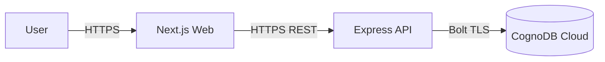
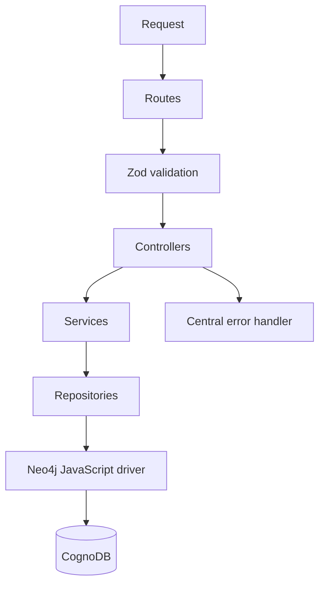
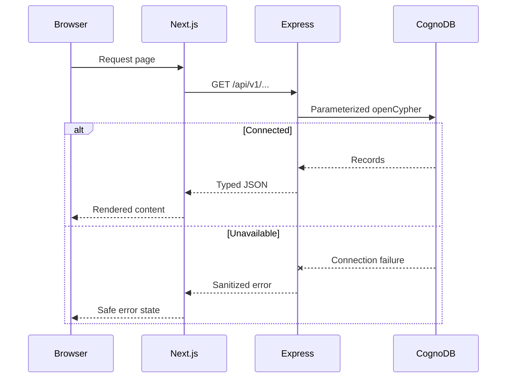

# Architecture

## System context

The frontend contains no database driver or CognoDB credentials.

## Backend layers

- **Routes** declare URLs, middleware, and handlers.
- **Controllers** translate validated HTTP input into service calls and envelopes.
- **Services** enforce domain behavior and typed not-found errors.
- **Repositories** own openCypher and convert Neo4j values to JSON-safe values.
- **Database module** owns the shared driver, connectivity checks, and graceful close.

## Frontend rendering

Directory and detail routes are Server Components. Career analysis and graph interaction are focused Client Components. This keeps database fetching server-controlled while shipping client state only for actual interaction.

## Failure flow

## Containers

Compose runs a standalone Next.js container and a compiled Express container. The API health check includes CognoDB connectivity; the web service waits for API health. Both containers run as non-root users.

## Environment boundaries

| Variable              | Consumer        | Browser-visible |
| --------------------- | --------------- | --------------- |
| `NEXT_PUBLIC_API_URL` | Next.js build   | Yes             |
| `WEB_ORIGIN`          | Express runtime | No              |
| `API_PORT`            | Express runtime | No              |
| `COGNODB_URI`         | Express runtime | No              |
| `COGNODB_USERNAME`    | Express runtime | No              |
| `COGNODB_PASSWORD`    | Express runtime | No              |
