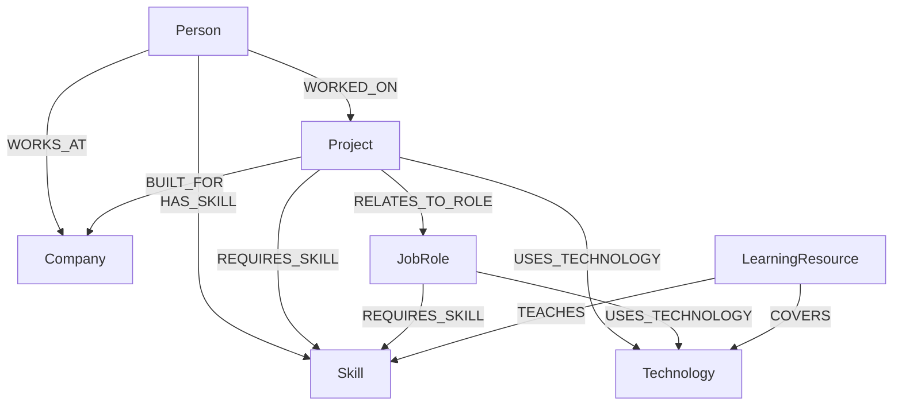

# SkillGraph Graph Data Model

## Purpose

SkillGraph models relationships between technology professionals, their skills,
the projects they have delivered, technologies used by those projects, career
roles, companies and learning resources.

The model is designed around connected questions such as:

- Which skills does a person already have?
- Which skills are required by a target role?
- Which required skills are missing?
- Which resources teach those missing skills?
- Which technologies appear across a person's project experience?
- Which projects and roles depend on a selected skill?

## Graph overview



## Node labels

### Person

Represents a fictional technology professional.

| Property    | Type   | Required | Description                   |
| ----------- | ------ | -------: | ----------------------------- |
| `id`        | String |      Yes | Stable public identifier      |
| `name`      | String |      Yes | Full name                     |
| `title`     | String |      Yes | Current professional title    |
| `location`  | String |      Yes | City and country              |
| `bio`       | String |      Yes | Short professional biography  |
| `avatarUrl` | String |       No | Optional fictional avatar URL |

Example:

```cypher
(:Person {
  id: "person-amara-okafor",
  name: "Amara Okafor",
  title: "Backend Engineer",
  location: "Lagos, Nigeria",
  bio: "Backend engineer focused on reliable APIs and distributed systems."
})
```

### Skill

Represents a transferable professional capability rather than a particular
software product.

| Property      | Type   | Required | Description              |
| ------------- | ------ | -------: | ------------------------ |
| `id`          | String |      Yes | Stable public identifier |
| `name`        | String |      Yes | Skill name               |
| `category`    | String |      Yes | Skill grouping           |
| `description` | String |      Yes | Concise explanation      |

Examples include API Design, Cloud Architecture, Data Modeling and Observability.

### Technology

Represents a concrete language, framework, platform, database or tool.

| Property      | Type   | Required | Description                                  |
| ------------- | ------ | -------: | -------------------------------------------- |
| `id`          | String |      Yes | Stable public identifier                     |
| `name`        | String |      Yes | Technology name                              |
| `category`    | String |      Yes | Language, framework, database, cloud or tool |
| `description` | String |      Yes | Concise explanation                          |

Examples include TypeScript, Express, Docker, Kubernetes and Redis.

### Project

Represents realistic fictional work through which people apply skills and
technologies.

| Property  | Type    | Required | Description                     |
| --------- | ------- | -------: | ------------------------------- |
| `id`      | String  |      Yes | Stable public identifier        |
| `name`    | String  |      Yes | Project name                    |
| `summary` | String  |      Yes | Project description             |
| `status`  | String  |      Yes | Active, completed or maintained |
| `year`    | Integer |      Yes | Representative project year     |

### JobRole

Represents a potential career target.

| Property      | Type   | Required | Description                |
| ------------- | ------ | -------: | -------------------------- |
| `id`          | String |      Yes | Stable public identifier   |
| `title`       | String |      Yes | Role title                 |
| `level`       | String |      Yes | Entry, mid, senior or lead |
| `description` | String |      Yes | Role summary               |

### Company

Represents a fictional employer, client or project organization.

| Property      | Type   | Required | Description               |
| ------------- | ------ | -------: | ------------------------- |
| `id`          | String |      Yes | Stable public identifier  |
| `name`        | String |      Yes | Company name              |
| `industry`    | String |      Yes | Industry classification   |
| `location`    | String |      Yes | Primary location          |
| `description` | String |      Yes | Short company description |

### LearningResource

Represents a fictional or intentionally curated learning resource.

| Property      | Type   | Required | Description                        |
| ------------- | ------ | -------: | ---------------------------------- |
| `id`          | String |      Yes | Stable public identifier           |
| `title`       | String |      Yes | Resource title                     |
| `type`        | String |      Yes | Course, lab, guide or book         |
| `level`       | String |      Yes | Beginner, intermediate or advanced |
| `url`         | String |      Yes | Resource URL                       |
| `description` | String |      Yes | Resource summary                   |

## Relationship types

### HAS_SKILL

```cypher
(:Person)-[:HAS_SKILL]->(:Skill)
```

Properties:

| Property      | Type    | Description                                |
| ------------- | ------- | ------------------------------------------ |
| `proficiency` | String  | Beginner, intermediate, advanced or expert |
| `years`       | Integer | Approximate years of experience            |

Purpose: records the person's existing capabilities for profile and career-gap
analysis.

### WORKED_ON

```cypher
(:Person)-[:WORKED_ON]->(:Project)
```

Properties:

| Property       | Type   | Description                  |
| -------------- | ------ | ---------------------------- |
| `role`         | String | Person's project role        |
| `contribution` | String | Concise contribution summary |

Purpose: connects people to evidence of applied work.

### WORKS_AT

```cypher
(:Person)-[:WORKS_AT]->(:Company)
```

Properties:

| Property         | Type    | Description                       |
| ---------------- | ------- | --------------------------------- |
| `sinceYear`      | Integer | Employment start year             |
| `employmentType` | String  | Full-time, contract or internship |

Purpose: provides current professional context.

### BUILT_FOR

```cypher
(:Project)-[:BUILT_FOR]->(:Company)
```

Purpose: connects a project to its fictional client or owning organization.

### USES_TECHNOLOGY

```cypher
(:Project)-[:USES_TECHNOLOGY]->(:Technology)
(:JobRole)-[:USES_TECHNOLOGY]->(:Technology)
```

Optional property:

| Property     | Type   | Description        |
| ------------ | ------ | ------------------ |
| `importance` | String | Core or supporting |

Purpose: identifies concrete tooling used by projects and associated with roles.

### REQUIRES_SKILL

```cypher
(:Project)-[:REQUIRES_SKILL]->(:Skill)
(:JobRole)-[:REQUIRES_SKILL]->(:Skill)
```

Properties:

| Property             | Type   | Description                           |
| -------------------- | ------ | ------------------------------------- |
| `importance`         | String | Core or supporting                    |
| `minimumProficiency` | String | Expected proficiency where applicable |

Purpose: powers skill dependency and career-gap calculations.

### RELATES_TO_ROLE

```cypher
(:Project)-[:RELATES_TO_ROLE]->(:JobRole)
```

Property:

| Property    | Type   | Description          |
| ----------- | ------ | -------------------- |
| `relevance` | String | Primary or secondary |

Purpose: connects portfolio experience to plausible career directions.

### TEACHES

```cypher
(:LearningResource)-[:TEACHES]->(:Skill)
```

Property:

| Property | Type   | Description                              |
| -------- | ------ | ---------------------------------------- |
| `depth`  | String | Introductory, practical or comprehensive |

Purpose: recommends resources for missing role skills.

### COVERS

```cypher
(:LearningResource)-[:COVERS]->(:Technology)
```

Property:

| Property | Type   | Description                              |
| -------- | ------ | ---------------------------------------- |
| `depth`  | String | Introductory, practical or comprehensive |

Purpose: provides technology-specific learning recommendations.

## Skill versus technology

A skill is a transferable capability, while a technology is a concrete tool.

Examples:

| Skill                  | Related technology context |
| ---------------------- | -------------------------- |
| API Design             | Express, FastAPI           |
| Containerization       | Docker                     |
| Orchestration          | Kubernetes                 |
| Data Modeling          | PostgreSQL, CognoDB        |
| Infrastructure as Code | Terraform                  |

SkillGraph does not add a vague `RELATED_TO` relationship. Associated
technologies are derived through projects and job roles where the relationship
has specific context.

## Identity strategy

Every node has a unique string `id`. Internal database IDs are not used in API
responses or URLs.

This provides:

- stable links;
- repeatable seed execution;
- clear debugging;
- independence from database storage internals.

## Constraint strategy

Each node label has a uniqueness constraint on `id`. This protects against
duplicate nodes and supplies an index for identifier lookups.

Name and title properties receive separate indexes because the application
searches and sorts by those properties.

## Scope boundaries

The first model deliberately excludes:

- authentication and application users;
- endorsements;
- certifications;
- salary information;
- real personal data;
- scraped job listings;
- generic `RELATED_TO` relationships.

These can be introduced later only when they serve a defined product query.
